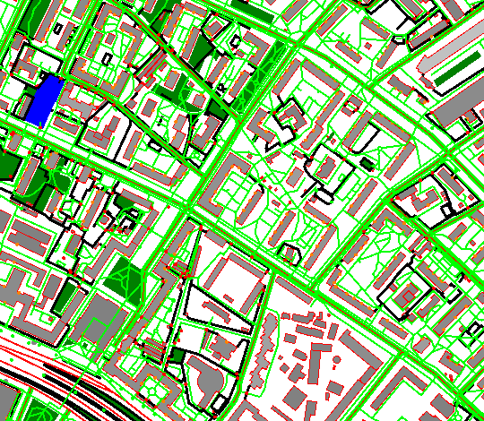
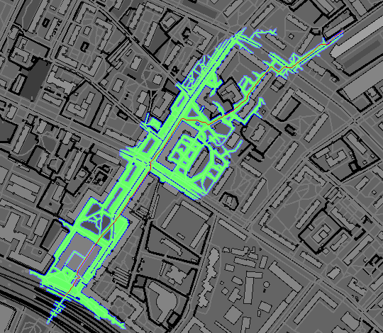
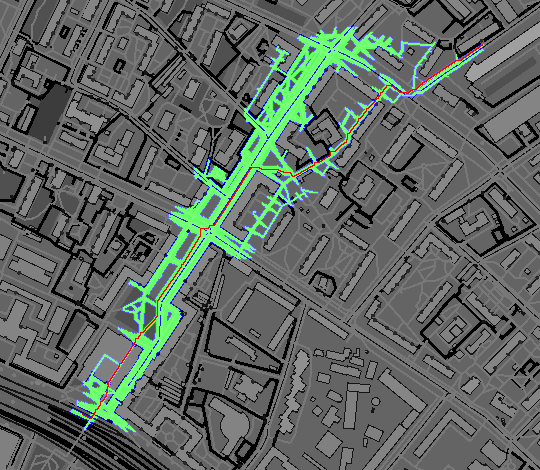
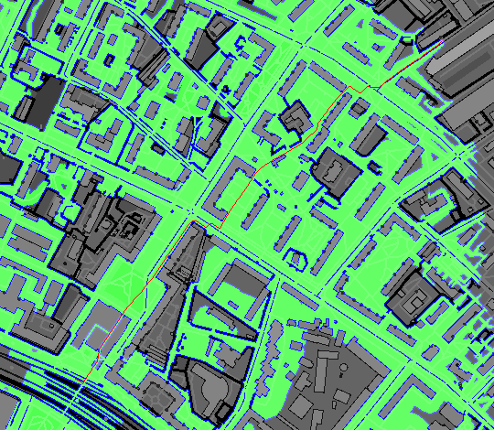

# Simple model of pedestrian traffic

By Yaroslav Sergienko.

## Examples

Here the shortest path from Airport subway station to Kochnovsky proesd is shown
with different settings:

Zones:



Squeezing allowed, euclidean heuristic:



No diagonal moves, manhattan heuristic:



Cutting corners, no heuristic:



## Description

Firstly, XML dump of target area is loaded from Open Street Map. After that raster map of pedestrian zones is generated. Examples of zones: footways, crosswalks, roads, grass, buildings, fence, water, gates (public or private). Each zone has corresponding cost of passing. And finally Dijkstra algorithm is applied to calculate shortest paths to some point, for example, subway station. This allows to calculate all shortest pedestrian paths from all buildings. 

## Files

* `results/*.png` --- results of algorithm with different settings.
* `aeroport.osm` --- XML map downloaded from OSM.
* `map2matrix.ipynb` --- Jupyter notebook, which generates `map.png` and `map.pgm` from `aeroport.osm`.
* `map.pgm` --- raster in binary format without header, just pixel values, one byte per pixel; width and height are provided through command-line.
* `map.png` --- png of previous file with zones encoded with colors for debug.
* `tree.c` --- C source of routines for working with tree structure.
* `calc_paths.c` --- C source of program, which calculates shortest paths.

## Zones list

Paths costs are stored as 64-bit integer numbers. Prices are applied per-pixel. `PRICE_MAX` constant has a value of `2^32`.

| Zone id |  Price  |      Name       |
| ------- | ------- | --------------- |
|    0    |   MAX   |     barriers    |
|   20    | MAX / 2 |  private gates  |
|   40    | MAX / 4 |    entrance     |
|   60    | MAX / 8 | special landuse |
|   80    |   40    |      grass      |
|   100   |   10    |     default     |
|   120   |   1     |     footway     |
|   128   | MAX / 16 | buildings of unknown number of floors |
|   129   | MAX / 16 | buildings with one floor |
|   130   | MAX / 16 | buildings with two floors |
|   ...   |   ...    |    ...         |

## Calculating paths

### Arguments

```
gcc -lm calc_paths.c
./a.out 2700 2100 1107 1021 300 300 d m
```

| arg | global | value | description |
| --- | ------ | ----- | ----------- |
|  1  | `width` | 2700 | width of `map.pgm` |
|  2  | `height` | 2100 | height of `map.pgm` |
|  3  | `sx` | 1107 | start X |
|  4  | `sy` | 1021 | start Y |
|  5  | `gx` | 300 | goal X |
|  6  | `gy` | 300 | goal Y |
|  7  | `diagonal` | `d` | `n` --- no diagonal moves, `d` --- diagonal moves allowed, `c` --- can cut corners, `s` --- can squeeze |
|  8  | `heuristic` | `m` | `n` --- none, `m` --- manhattan, `o` --- octile (diagonal), `e` --- euclid, `c` --- chebyshev |

To produce adequate results, start and goal must belong to zones with price like footways,
so graphic editor software may be needed to find precise start and goal coordinates (use `map.png` file for that).

You cannot use manhattan heuristic with diagonal mode not set to `n` because the metric produces overestimated results.

### Data structure

The main data structure is a binary prefix tree where keys are binary representations of path costs (of fixed length `TREE_H * TREE_X`). All path costs are supposed to be integer numbers.

Each node correspons to `TREE_D` consequtive entries of `tree_t` type in the `tree` array. Each entry contain id of child tree node or zero if child is not yet created. Tree entries start from index 1 (because index zero corresponds to missing nodes).

On the last level entries contain pixel coordinates which have corresponding calculated path cost. If there are several pixels with same path cost, they form linked list by using `next_cell` array.

Tree nodes are never destroyed, but it is allowed to have multiple entries for the same pixel.

Pixel coordinates are encoded as `y * width + x`.

| constant | description |
| -------- | ----------- |
| `TREE_D` | number of children of each tree node |
| `TREE_X` | `TREE_D` be equal to `2^TREE_X` |
| `TREE_M` | bit mask of tree children; must be equal to `2^TREE_X - 1` |
| `TREE_H` | height of the tree; max value the tree can handle is `TREE_D ^ TREE_H` |
| `TREE_MAX_SIZE` | used to allocate space for tree structures; is equal to maximum node count multiplied by `TREE_D` |

| type | alias | description |
| ---- | ----- | ----------- |
| `dist_t` | `uint64_t` | used to store path prices |
| `map_t` | `uint8_t` | zones ids |
| `status_t` | `utint8_t` | leaf status: `UNSET`, `OPEN` or `CLOSED` |
| `tree_t` | `uint32_t` | tree nodes ids |

| type | global | description |
| ---- | ------ | ----------- |
| `size_t` | `width`, `height`, `wh` | width, height, and `width * height` |
| `dist_t[wh]` | `dists` | calculated path costs for each pixel of map |
| `map_t[wh]` | `map` | zones ids from `map.pgm` |
| `status_t[wh]` | `statuses` | pixel statuses |
| `tree_t[TREE_MAX_SIZE]` | `tree` | tree entries |
| `tree_t[wh]` | `next_cell` | next pixel with same path cost |
| `tree_t` | `tree_size` | number of nodes in tree |

There is a special structure `tree_pos_t` which is a reference to some pixel with information about all parent tree nodes. It has field `finished` which is set to `1` when there is no pixel with larger path cost.

| routine | params | description |
| ------- | ------ | ----------- |
| `add_to_tree` | `tree_t ix, dist_t val` | adds pixel `ix` with distance `val` to tree |
| `init_tree` | `tree_t ix` | initializes tree with single pixel `ix` with path cost `0` |
| `next_pos` | `tree_pos_t *tp` | updates pixel reference to point to the next pixel with smallest path cost |

### Algorithm

1. Initialize tree (`init_tree` and other).
2. Find pixel `ix` with smallest path cost (`next_pos`).
3. If `ix` status is `CLOSED`, then ignore duplicate entry, goto 2.
4. For each its neighbor pixel `pos` (`make_closed`)
   * Calculate new approximation of path cost.
   * If its status is `UNSET`, make it `OPEN` and set path cost.
   * If its status is `OPEN`, update path cost if new cost is less.
5. Change status of pixel `ix` to `CLOSED`.


